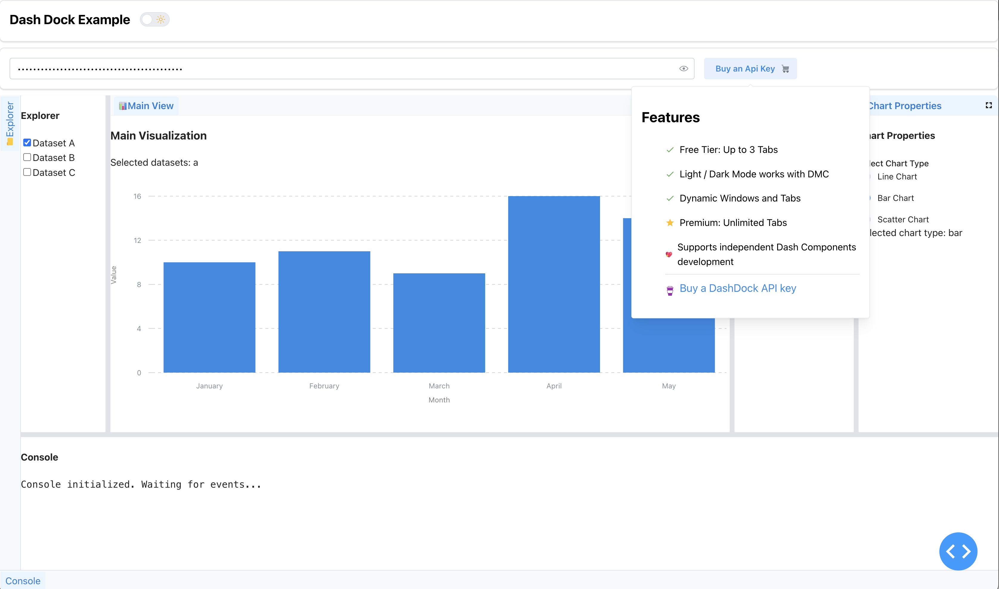

# Dash Dock

A flexible docking window system for Dash applications.

## Docs
https://pip-install-python.com/pip/dash_dock



## Features

- Create dock-able, resizable, and floatable windows in your Dash apps
- Drag and drop tabs between dock containers
- Maximize, close, and pop-out tabs
- Compatible with both Dash 2 and Dash 3
- Free version with up to 3 tabs
- Premium version with unlimited tabs (requires API key)

## Installation

```bash
pip install dash-dock
```

## Simple Example

```python
import dash
from dash import html
import dash_dock

app = dash.Dash(__name__)

# Define the layout configuration
dock_config = {
    "global": {
        "tabEnableClose": False,
        "tabEnableFloat": True
    },
    "layout": {
        "type": "row",
        "children": [
            {
                "type": "tabset",
                "children": [
                    {
                        "type": "tab",
                        "name": "Tab 1",
                        "component": "text",
                        "id": "tab-1",
                    }
                ]
            },
            {
                "type": "tabset",
                "children": [
                    {
                        "type": "tab",
                        "name": "Tab 2",
                        "component": "text",
                        "id": "tab-2",
                    }
                ]
            }
        ]
    }
}

# Create tab content components
tab_components = [
    dash_dock.Tab(
        id="tab-1",
        children=[
            html.H3("Tab 1 Content"),
            html.P("This is the content for tab 1")
        ]
    ),
    dash_dock.Tab(
        id="tab-2",
        children=[
            html.H3("Tab 2 Content"),
            html.P("This is the content for tab 2")
        ]
    )
]

# Main app layout
app.layout = html.Div([
    html.H1("Dash Dock Example"),
    dash_dock.DashDock(
        id='dock-layout',
        model=dock_config,
        children=tab_components,
        useStateForModel=True
    )
])

if __name__ == '__main__':
    app.run_server(debug=True)
```

## Premium Version

DashDock is available in two versions:

- **Free Version**: Limited to 3 tabs
- **Premium Version**: Unlimited tabs (requires API key)

To use the premium version, obtain an API key and include it in your DashDock component:

```python
dash_dock.DashDock(
    id='dock-layout',
    model=dock_config,
    children=tab_components,
    apiKey="your-api-key-here"
)
```

### Getting an API Key

Visit [My Shop](https://pipinstallpython.pythonanywhere.com/catalogue/dash-dock_96/) to obtain an API key for the premium version.

## Component Properties

### DashDock

| Property | Type | Description |
|----------|------|-------------|
| `id` | string | The ID used to identify this component |
| `model` | object | FlexLayout model configuration |
| `children` | list | React components to render in the tabs |
| `headers` | object | Custom headers for tabs |
| `useStateForModel` | boolean | Use internal state for the model (default: false) |
| `font` | object | Override font styles for tabs |
| `supportsPopout` | boolean | Whether pop-out windows are supported |
| `popoutURL` | string | URL for pop-out windows |
| `realtimeResize` | boolean | Resize tabs during dragging (default: false) |
| `apiKey` | string | API key for premium features |
| `freeTabLimit` | number | Maximum number of tabs in free version (default: 3) |
| `debugMode` | boolean | Enable debug mode (default: false) |

### Tab

| Property | Type | Description |
|----------|------|-------------|
| `id` | string | The ID used to identify this tab |
| `children` | list | React components to render in the tab |

## Development

### Prerequisites

- Node.js >= 14
- npm >= 6
- Python >= 3.7

### Setup

1. Clone the repository:
   ```bash
   git clone https://github.com/pip-install-python/dash-dock.git
   cd dash-dock
   ```

2. Create a Python virtual environment:
   ```bash
   python -m venv venv
   source venv/bin/activate  # On Windows: venv\Scripts\activate
   ```

3. Install dependencies:
   ```bash
   pip install -r requirements.txt
   npm install
   ```

4. Build the component:
   ```bash
   npm run build
   ```

5. Run the example:
   ```bash
   python usage.py
   ```

## License

This was created under the [Pip Install Python LLC](https://pip-install-python.com) and licensed under the MIT License.
